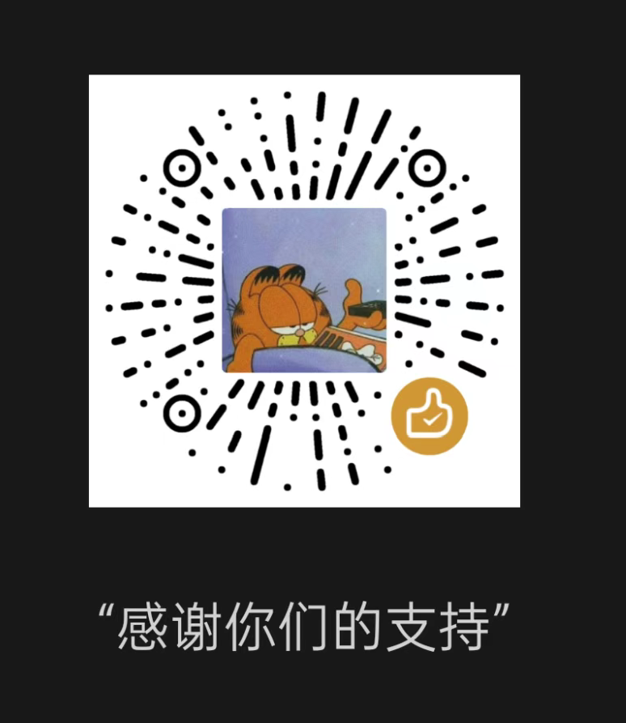

[English](https://github.com/FormulaChenZen/ScreenProtector/blob/master/README.en.md) | [中文](https://github.com/FormulaChenZen/ScreenProtector/blob/master/README.md)

# Screen Protector

Screen Protector 是一款轻量级的 Windows 桌面应用程序，旨在通过自动调节屏幕亮度来保护用户的眼睛。当检测到用户长时间未操作电脑时，应用会自动将屏幕亮度降至最低，减少蓝光辐射和眼睛疲劳。

**✨ 特别推荐笔记本用户使用！** 该应用不仅能保护眼睛，还能有效**防止 OLED 屏幕烧屏**、**延长笔记本续航时间**。作者已在自己的笔记本上进行了充分验证，**稳定好用，值得信赖**。

## 主要功能

- **自动亮度调节**：根据用户设定的空闲时间阈值，自动降低屏幕亮度，保护眼睛。
- **OLED 屏幕烧屏防护**：通过自动降低亮度和基础屏幕保护，有效防止 OLED 屏幕烧屏现象。
- **延长笔记本续航**：降低屏幕亮度可显著降低屏幕功耗，延长笔记本电池续航时间。
- **手动亮度调节**：提供滑动条和输入框，允许用户手动调节屏幕亮度。
- **开机自启动**：支持设置开机自动启动，确保功能始终生效。
- **系统托盘集成**：最小化到系统托盘，不占用任务栏空间，方便快速访问。
- **个性化设置**：允许用户自定义空闲时间阈值和亮度级别。

## 使用方法

1. **启动应用**：运行 `ScreenProtector.exe` 启动应用。
2. **设置空闲时间**：在应用界面中调节「空闲时间」滑动条，设置自动降低亮度的空闲时间阈值（单位：秒）。
3. **启用自动调节**：勾选「启用空闲检测」复选框，激活自动亮度调节功能。
4. **手动调节亮度**：使用「亮度」滑动条或输入框，手动调节屏幕亮度。
5. **开机自启动**：勾选「开机自启动」复选框，设置应用随系统启动。
6. **最小化到托盘**：点击最小化按钮，应用将隐藏到系统托盘，双击托盘图标可恢复窗口。

## 命令行参数

- `-startup`：以静默模式启动应用，直接隐藏到系统托盘。

## 了解更多工具

如果您需要更多实用工具和功能，欢迎访问我们的在线工具网站：**[🌐 Rumystic.com](https://rumystic.com)** 

我们提供各种网络工具、生产力应用和开发者工具，帮助您提高工作效率。如果您对 Screen Protector 的功能有任何建议或需求，也欢迎在网站上与我们联系。

## 注意事项

- 应用需要管理员权限才能调节屏幕亮度。
- 部分显示器可能不支持 WMI 亮度调节，此时应用将无法调节亮度。
- 如需卸载，请先关闭应用并删除启动项。

## 💝 赞助支持

感谢您对 Screen Protector 的支持和认可！如果您觉得这个应用对您有帮助，欢迎通过以下方式赞助我们，您的支持将激励我们继续改进和优化应用：

  

感谢您的支持！❤️